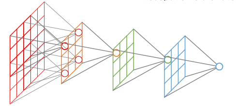

# Basics-of-Computer-Vision
A notebook about most basic knowledge of Computer Vision

## 卷积

## 反卷积

## 感受野
### 感受野的定义
在卷积神经网络中，感受野的定义是 卷积神经网络每一层输出的特征图（feature map）上的像素点在原始图像上映射的区域大小。

### 感受野的计算

 RF = 1 #待计算的feature map上的感受野大小
　　for layer in （top layer To down layer）:
　　　　RF = ((RF -1)* stride) + fsize

## 激活函数

## 

##